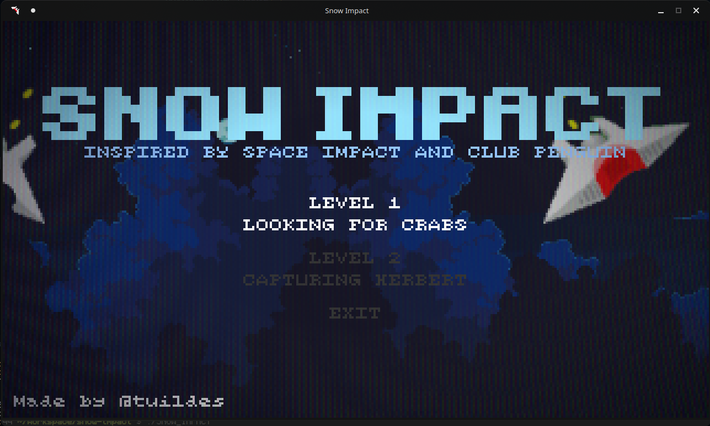

<!-- HEADER -->
<p align="center">
  
  <h3 align="center">Snow Impact</h3>
  <p align="center">Spaceship game inspired by Space Impact and Club Penguin</p>
</p>
<!-- HEADER -->

## Sobre

The "Snow Impact" project consists of a reimagining of the classic game Space Impact, but made entirely in C and Allegro5, now with a Club Penguin theme.

The Game has:
* Home screen
* 2 stages with iconic bosses from the Club Penguin universe
* A captivating story
* 9 different enemies
* A statistics screen
* *And more...*

## Screenshots do projeto

* Home screen:


* History:


* Gameplay:


*Boss:


* End of game screen:


## How to play

* **[Arrow keys]** to move around the game
* **[Space]** to shoot and interact
* **[ESC]** or **[P]** to pause the game
* **[D]** to enable debug information

* **Exit screen button** to exit

## How to change difficulty and other parameters

Just go to the `includes/env.h` file and edit your information and definitions to adapt the game to your difficulty and needs.
For example, to change the game screen size:

```c
#define DISP_SCALE 4 // Change it to the value you prefer (integer like 1, 2, ...)
```

<br />

<p align="center">Created with 💙 by <a href="https://github.com/tuildes">tuildes</a></p>
